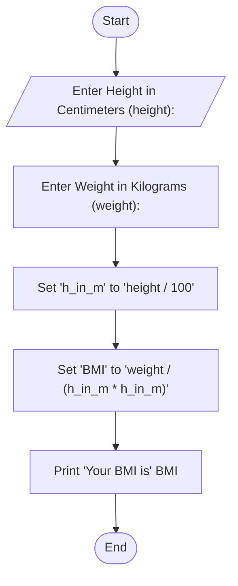

#Flowchart
'''mermaid
graph TD;
  A([Start]) --> B("'DAYS = **30**
  NUMBER_OF_WAREHOUSE = 4'")-->C["int i = 0"];
  C --> D[/"Enter warehouse(warehousenum)
  product type(prtype)
  Quantity of product(quantity)"/];
  D --> E["warehouse[warehousenum - 1][i] = quantity
  products[prtype] += quantity
  table[prtype-1][warehousenum-1] += quantity"];
  F[i++] --> G{Is i<DAYS};
  G -- Yes --> D;
  G -- No --> H[/Print tabular format/];
  '''
  

